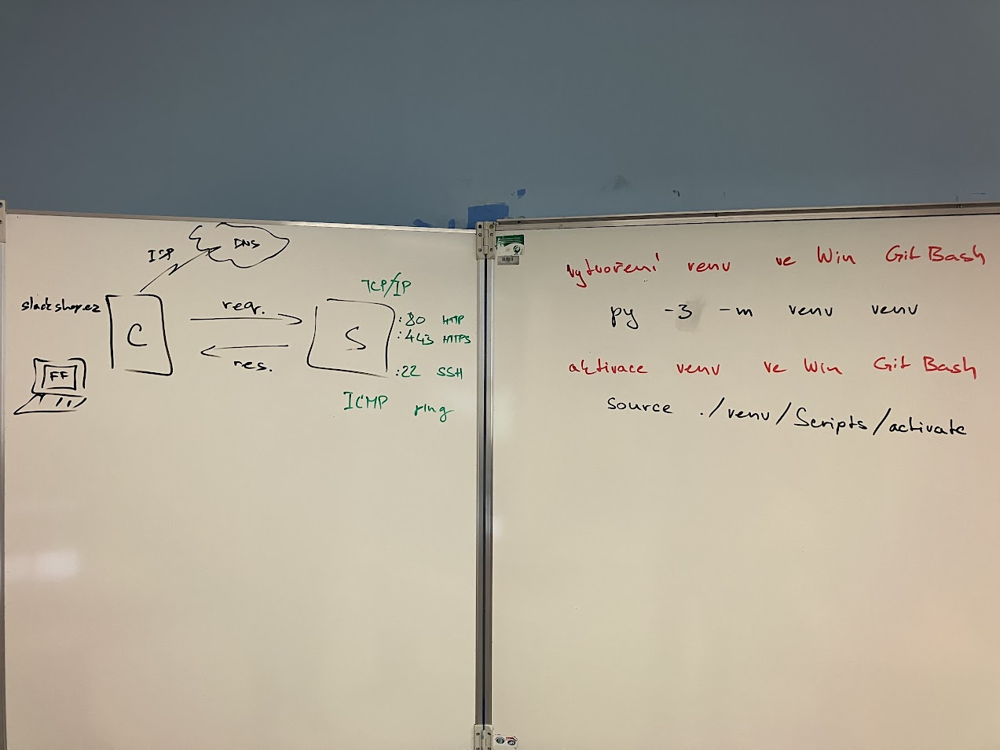

# Webova aplikace hodina 9.2.2023

Na hodine 9.2.2024 jsme si rikali jak vytvorit virtualni prostredi v pythonu v GitBashi. Nasledni jak jej activovat pomoci source ./venv/Scripts/activate. Nasledne jsme si rikali zakladni pojmy typu request, response.